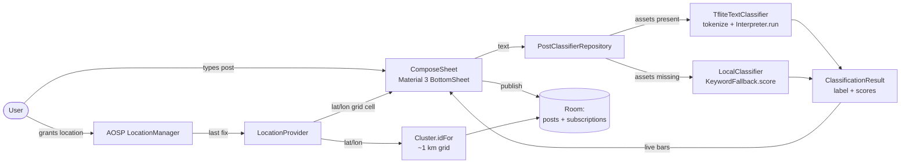

# LocUp — On-device text classification on Android

> A hyperlocal social feed that classifies every post **on-device** with
> TensorFlow Lite. No servers, no API keys, no Play Services.


## What it is

LocUp is a small Android MVP that explores one idea: *can a
neighbourhood social feed classify its own posts — Emergency / Traffic
/ Event / Civic / General — without ever calling a server?*

The app reads the user's GPS, buckets the post into a stable `~1 km ×
1 km` grid cell, and runs a **word-embedding text classifier on the
device CPU/NPU**. The UI shows the live probability distribution for
all five labels as the user types, then publishes the post with the
winning label + confidence attached.

If the TFLite model assets can't be loaded, the classifier transparently
falls back to a deterministic keyword scorer so the end-to-end flow
stays demoable on any device.

---

## Architecture



UI thread never touches the interpreter directly — `PostClassifierRepository`
is the single entry point, owned by `MainActivity`, threaded down to
`LocUpApp.kt`. No DI framework, no Hilt, no Firebase.

---

## How the local TensorFlow model was built

### 1. Tooling

Started with `tflite-model-maker` (MobileBERT) → broken dependency pin
on current Colab. Switched to `mediapipe-model-maker` → installed but
collapsed on a `pyyaml`/`Cython`/`numpy` chain three layers deep.
Abandoned both Model Maker libraries.

Built the model from scratch with **plain `tensorflow` / `keras`** —
already preinstalled in Colab, zero extra `pip install` calls.

### 2. Vocabulary — built only from `train.csv`

```python
def tokenize(text):
    return re.findall(r"[a-zA-Z0-9']+", text.lower())

counter = Counter()
for t in train_texts:
    counter.update(tokenize(t))

most_common = [w for w, _ in counter.most_common(VOCAB_SIZE - 2)]  # top 3000
word_to_idx = {"<PAD>": 0, "<OOV>": 1}
for i, w in enumerate(most_common):
    word_to_idx[w] = i + 2
```

Test data is never seen during vocab construction.

### 3. Encoding to a fixed-length integer array

```python
def encode(text):
    tokens = tokenize(text)[:SEQ_LEN]                # SEQ_LEN = 24
    ids = [word_to_idx.get(t, 1) for t in tokens]     # 1 = OOV
    ids += [0] * (SEQ_LEN - len(ids))                 # 0 = PAD
    return ids
```

### 4. Model architecture

```python
model = keras.Sequential([
    keras.layers.Input(shape=(SEQ_LEN,), dtype=tf.int32),
    keras.layers.Embedding(input_dim=VOCAB_SIZE, output_dim=48),
    keras.layers.GlobalAveragePooling1D(),
    keras.layers.Dense(64, activation='relu'),
    keras.layers.Dropout(0.3),
    keras.layers.Dense(NUM_CLASSES, activation='softmax'),
])
model.compile(optimizer='adam',
              loss='sparse_categorical_crossentropy',
              metrics=['accuracy'])
model.fit(X_train, y_train,
          validation_data=(X_test, y_test),
          epochs=25, batch_size=32)
```

Standard ops only — embedding, pooling, dense — no custom or
text-processing ops in the graph. **Tokenization happens outside the
model entirely**, which is what made the TFLite conversion
trouble-free where the BERT paths kept failing.

### 5. Conversion to TFLite

```python
converter = tf.lite.TFLiteConverter.from_keras_model(model)
tflite_model = converter.convert()
```

### 6. Shipped artifacts (3 files, dropped into `app/src/main/assets/`)

- `locup_text_classifier.tflite` — the converted model (579 KB)
- `vocab.json` — the `word_to_idx` map, dumped as-is
- `labels.txt` — the 5 label names, in the same order as the model's
  output layer (`idx_to_label`)

### 7. Verified before shipping

Ran the exported `.tflite` (not the in-memory Keras model) through
`tf.lite.Interpreter` directly against real sentences, to confirm the
**actual shipped file** behaves correctly — not just the pre-export
version.

End-to-end pipeline:

```
CSV → vocab/encoding → Keras training → TFLiteConverter → 3 assets in APK
```

---

## How TensorFlow Lite is wired into the Android app

### 1. Dependency

Plain TFLite runtime — no Task Library, no MediaPipe Tasks (both expect
BERT-style embedded tokenizer metadata that the word-embedding model
doesn't produce):

```kotlin
implementation("org.tensorflow:tensorflow-lite:2.14.0")
```

### 2. Assets in the APK

Three files in `app/src/main/assets/`, all produced by the Colab notebook:

- `locup_text_classifier.tflite` — the model
- `vocab.json` — word → index map (578 entries)
- `labels.txt` — the 5 labels, in model output order

### 3. Loading the model

`TfliteTextClassifier` is `lazy` and tries to load all three via
`context.assets`:

- **Model** — `context.assets.openFd()` → `FileInputStream` →
  `FileChannel.map()` into a `MappedByteBuffer`, then `Interpreter(buffer)`.
- **Vocab** — read `vocab.json` as text, parse with `org.json.JSONObject`
  into a `Map<String, Int>`.
- **Labels** — read `labels.txt` line by line into a `List<String>`.

Wrapped in a `try/catch` that returns `null` on any failure (missing
asset, malformed file) rather than throwing — that's what
`isModelAvailable` checks.

### 4. Tokenising on-device

The critical piece: **Kotlin re-implements the exact same logic as the
Python training code**, so the model sees input in the same shape it
was trained on.

```kotlin
private val TOKEN_REGEX = Regex("[a-zA-Z0-9']+")

fun tokenize(text: String): List<String> =
    TOKEN_REGEX.findAll(text.lowercase()).map { it.value }.toList()

fun encode(text: String, vocab: Map<String, Int>): IntArray {
    val tokens = tokenize(text).take(SEQ_LEN)                   // SEQ_LEN = 24
    val ids = IntArray(SEQ_LEN) { PAD_INDEX }                   // 0 = PAD
    tokens.forEachIndexed { i, t -> ids[i] = vocab[t] ?: OOV_INDEX }  // 1 = OOV
    return ids
}
```

### 5. Running inference

```kotlin
val input  = Array(1) { inputIds }                  // shape [1, 24]
val output = Array(1) { FloatArray(labels.size) }   // shape [1, 5]
interpreter.run(input, output)
```

Plain `Interpreter.run()` — no preprocessing / postprocessing helpers,
since there's no bundled metadata to drive them.

### 6. Exposing results

Output floats zipped with label names into `LabelScore(label, score)`,
sorted descending — that's the live probability distribution shown as
the user types.

### 7. Fallback wiring

`PostClassifierRepository` sits in front of `TfliteTextClassifier`:
checks `isModelAvailable` first, uses the real model if present,
otherwise falls back to the existing keyword scorer — so the app stays
demoable even without the `.tflite` asset bundled.

---

## Skills demonstrated

**Android**

- Jetpack Compose UI with Material 3 (bottom-sheet composer, live
  probability bars, in-feed chips)
- Room persistence for posts + subscriptions
- AOSP `LocationManager` (no Google Play Services dependency)
- Manual dependency wiring (no DI framework, no Hilt)

**AI / ML**

- End-to-end on-device text classification — CSV → TFLite → APK
- Custom Keras word-embedding model (Embedding + Pooling + Dense)
  trained in Colab with **plain `tensorflow`/`keras`** after Model Maker
  paths failed
- TFLite conversion with **standard ops only** — no custom or
  text-processing ops in the graph
- TFLite `Interpreter` loaded via memory-mapped `FileChannel.map()`
- In-Kotlin tokenizer that **mirrors the training pipeline exactly** so
  the deployed model sees input in the same shape it was trained on
- Graceful fallback to a deterministic keyword scorer when the TFLite
  assets are missing

---

## Build & test

```bash
./gradlew assembleDebug
./gradlew test
```

APK lands in `app/build/outputs/apk/debug/`. Tests cover `Cluster.idFor`
geo-bucketing and the `KeywordFallback` scorer.

## Permissions

- `ACCESS_FINE_LOCATION` / `ACCESS_COARSE_LOCATION` — attach the
  current `Cluster.id` to a new post (declined permits fall back to a
  demo Bengaluru coordinate).
- `INTERNET` — declared for completeness; **the app does not network
  out**.

---

## Repo layout

```
app/src/main/java/com/locup/mvp
├── MainActivity.kt                            # wires LocationProvider + classifier + repo + Compose tree
├── classifier/
│   ├── PostClassifierRepository.kt             # single entry point: real model or fallback
│   └── TfliteTextClassifier.kt                 # TFLite Interpreter + in-Kotlin tokenizer
├── ml/
│   ├── LocalClassifier.kt                     # TFLite wrapper used by the fallback path
│   └── KeywordFallback.kt                     # deterministic hash-BoW scorer
├── model/
│   ├── Post.kt                                # Cluster.idFor(lat, lon) ~1km grid bucket
│   └── LocationProvider.kt                    # AOSP LocationManager wrapper
├── repo/
│   ├── LocUpRepository.kt                     # facade over DAOs + classifier
│   └── LandmarkRepository.kt                  # lat/lon -> "Near {area}" label
├── data/
│   ├── TownTalkDatabase.kt                    # Room DB (posts + subscriptions)
│   ├── entity/                                # PostEntity, SubscriptionEntity
│   └── dao/                                   # PostDao, SubscriptionDao
└── ui/
    └── LocUpApp.kt                            # Scaffold + feed + ComposeSheet + filter chips
```

Training script: `tools/train_locup_classifier.py`.

---

## License

MIT.
