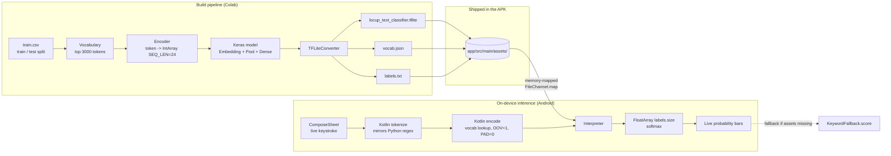

# LocUp — On-device text classification on Android

> A hyperlocal social feed that classifies every post on-device with
> TensorFlow Lite. No servers, no API keys, no Play Services.


## What it is

LocUp is a tiny Android MVP that explores one idea: *can a
neighbourhood social feed classify its own posts — Emergency / Traffic
/ Event / Civic / General — without ever calling a server?*

The app reads the user's GPS, buckets the post into a stable `~1 km ×
1 km` grid cell, and runs a **word-embedding text classifier on the
device CPU/NPU**. The UI shows the live probability distribution for
all five labels as the user types, then publishes the post with the
winning label + confidence attached.

If the TFLite model assets can't be loaded, the classifier transparently
falls back to a deterministic keyword scorer so the end-to-end flow
stays demoable on any device.

---

## Approach — local model inference, end to end



**Plain Python on the build side, plain `Interpreter` on the device
side — no Task Library, no MediaPipe, no bundled tokenizer metadata.**

The model side intentionally **tokenizes outside the graph** (custom
Keras `Embedding` + `GlobalAveragePooling1D` + `Dense`). That keeps
the TFLite graph to standard ops only, which is what makes the
conversion and on-device run trouble-free.

---

## Build the model

```python
def tokenize(text):
    return re.findall(r"[a-zA-Z0-9']+", text.lower())

counter = Counter()
for t in train_texts:
    counter.update(tokenize(t))

most_common = [w for w, _ in counter.most_common(VOCAB_SIZE - 2)]
word_to_idx = {"<PAD>": 0, "<OOV>": 1}
for i, w in enumerate(most_common):
    word_to_idx[w] = i + 2

def encode(text):
    tokens = tokenize(text)[:SEQ_LEN]                # SEQ_LEN = 24
    ids = [word_to_idx.get(t, 1) for t in tokens]     # 1 = OOV
    ids += [0] * (SEQ_LEN - len(ids))                 # 0 = PAD
    return ids

model = keras.Sequential([
    keras.layers.Input(shape=(SEQ_LEN,), dtype=tf.int32),
    keras.layers.Embedding(input_dim=VOCAB_SIZE, output_dim=48),
    keras.layers.GlobalAveragePooling1D(),
    keras.layers.Dense(64, activation='relu'),
    keras.layers.Dropout(0.3),
    keras.layers.Dense(NUM_CLASSES, activation='softmax'),
])
model.compile(optimizer='adam',
              loss='sparse_categorical_crossentropy',
              metrics=['accuracy'])
model.fit(X_train, y_train, validation_data=(X_test, y_test),
          epochs=25, batch_size=32)

converter = tf.lite.TFLiteConverter.from_keras_model(model)
tflite_model = converter.convert()
```

Drop the three artefacts into `app/src/main/assets/` and the app
picks them up. The same `regex` and `SEQ_LEN` shape are
re-implemented in Kotlin so the device sees input in the exact
shape the model was trained on.

---

## Run inference on the device

`PostClassifierRepository` is the single entry point. It owns
`TfliteTextClassifier` (real model) and `LocalClassifier` (keyword
fallback) and picks at call time.

```kotlin
private val TOKEN_REGEX = Regex("[a-zA-Z0-9']+")

fun tokenize(text: String): List<String> =
    TOKEN_REGEX.findAll(text.lowercase()).map { it.value }.toList()

fun encode(text: String, vocab: Map<String, Int>): IntArray {
    val tokens = tokenize(text).take(SEQ_LEN)                   // SEQ_LEN = 24
    val ids = IntArray(SEQ_LEN) { PAD_INDEX }                   // 0 = PAD
    tokens.forEachIndexed { i, t -> ids[i] = vocab[t] ?: OOV_INDEX }  // 1 = OOV
    return ids
}

val input  = Array(1) { inputIds }                  // [1, 24]
val output = Array(1) { FloatArray(labels.size) }   // [1, 5]
interpreter.run(input, output)
```

Loading uses `context.assets.openFd()` → `FileChannel.map()` → a
memory-mapped `MappedByteBuffer`, so first-inference start-up is
essentially free. If any of the three assets is missing the model
returns `null` from `tryLoad()` and the repository falls back to the
keyword scorer — banner turns green when the real path is active.

---

## Skills demonstrated

**Android**

- Jetpack Compose UI with Material 3 (bottom-sheet composer, live
  probability bars, in-feed chips)
- Room persistence for posts + subscriptions
- AOSP `LocationManager` (no Google Play Services dependency)
- Manual dependency wiring (no DI framework, no Hilt)

**AI / ML**

- End-to-end on-device text classification — CSV → Keras → TFLite →
  APK assets → in-app `Interpreter`
- Custom Keras word-embedding model (Embedding + Pool + Dense),
  standard ops only
- TFLite `Interpreter` loaded via memory-mapped `FileChannel.map()`
- In-Kotlin tokenizer that **mirrors the training pipeline exactly**
  so the deployed model sees input in the same shape it was trained on
- Graceful fallback to a deterministic keyword scorer when the TFLite
  assets are missing

---

## Build & test

```bash
./gradlew assembleDebug
./gradlew test
```

APK lands in `app/build/outputs/apk/debug/`. Tests cover `Cluster.idFor`
geo-bucketing and the `KeywordFallback` scorer.

## Permissions

- `ACCESS_FINE_LOCATION` / `ACCESS_COARSE_LOCATION` — attach the
  current `Cluster.id` to a new post (declined permits fall back to a
  demo Bengaluru coordinate).
- `INTERNET` — declared for completeness; **the app does not network
  out**.

---

## Repo layout

```
app/src/main/java/com/locup/mvp
├── MainActivity.kt                            # wires LocationProvider + classifier + repo + Compose tree
├── classifier/
│   ├── PostClassifierRepository.kt             # single entry point: real model or fallback
│   └── TfliteTextClassifier.kt                 # TFLite Interpreter + in-Kotlin tokenizer
├── ml/
│   ├── LocalClassifier.kt                     # TFLite wrapper used by the fallback path
│   └── KeywordFallback.kt                     # deterministic hash-BoW scorer
├── model/
│   ├── Post.kt                                # Cluster.idFor(lat, lon) ~1km grid bucket
│   └── LocationProvider.kt                    # AOSP LocationManager wrapper
├── repo/
│   ├── LocUpRepository.kt                     # facade over DAOs + classifier
│   └── LandmarkRepository.kt                  # lat/lon -> "Near {area}" label
├── data/
│   ├── TownTalkDatabase.kt                    # Room DB (posts + subscriptions)
│   ├── entity/                                # PostEntity, SubscriptionEntity
│   └── dao/                                   # PostDao, SubscriptionDao
└── ui/
    └── LocUpApp.kt                            # Scaffold + feed + ComposeSheet + filter chips
```

Training script: `tools/train_locup_classifier.py`.

---

## License

MIT.
